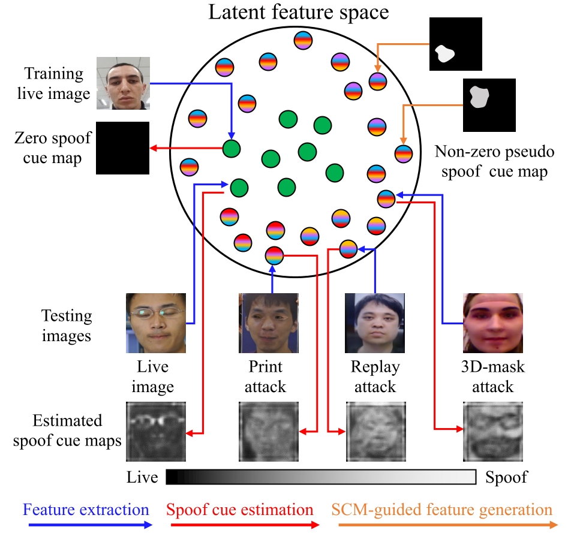
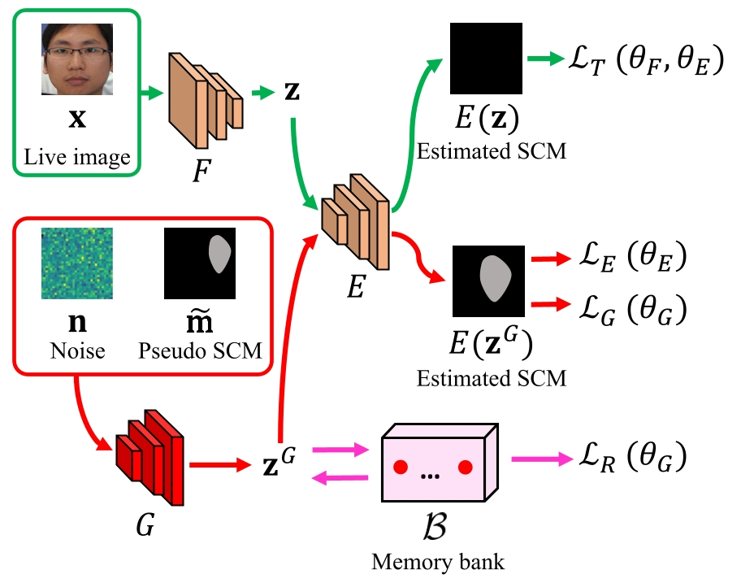

# CVPR24_OC_SCMNet

### One-Class Face Anti-spoofing via Spoof Cue Map-Guided Feature Learning (CVPR '24)

## Illustration of the proposed idea of SCM-guided feature learning for one-class face anti-spoofing (FAS).


## Architecture of OC-SCMNet



## Training & Testing
Run `train.py` to train OC-SCMNet

Run `test.py` to test OC-SCMNet


## Citation

If you use the OC-SCMNet, please cite the paper:
 ```
@inproceedings{huang2024one,
  title={ One-Class Face Anti-spoofing via Spoof Cue Map-Guided Feature Learning},
  author={Huang, Pei-Kai and Chiang, Cheng-Hsuan and Chen, Tzu-Hsien and Chong, Jun-Xiong and Liu, Tyng-Luh and Hsu, Chiou-Ting},
  booktitle={Proceedings of the IEEE/CVF Conference on Computer Vision and Pattern Recognition},
  year={2024},
}

```
